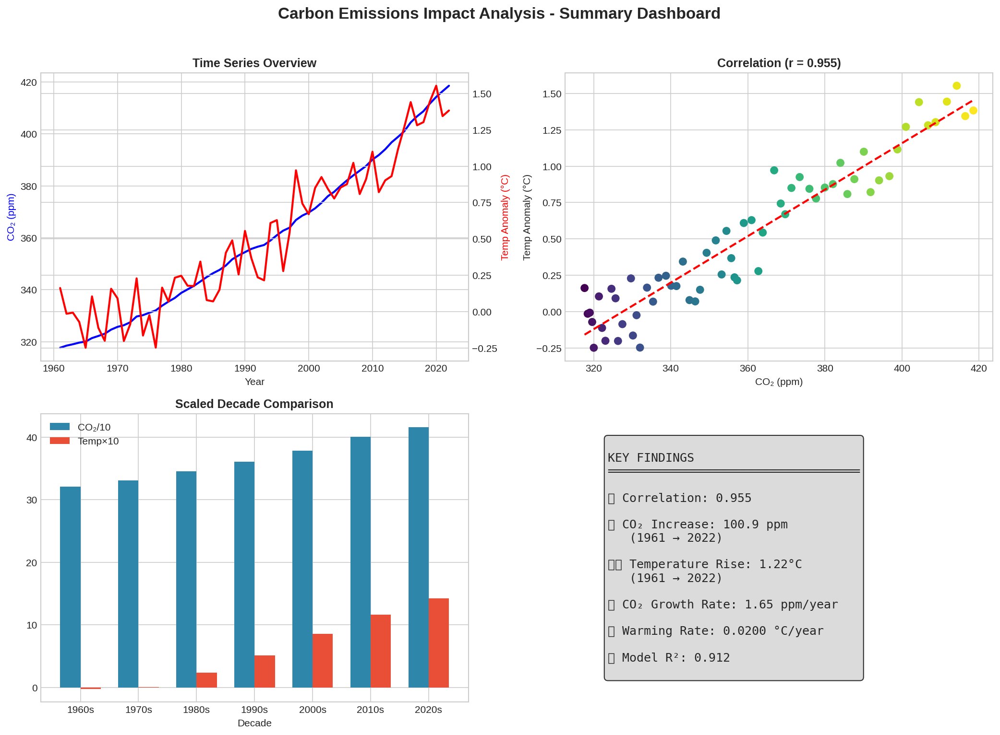
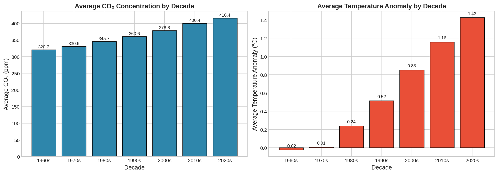
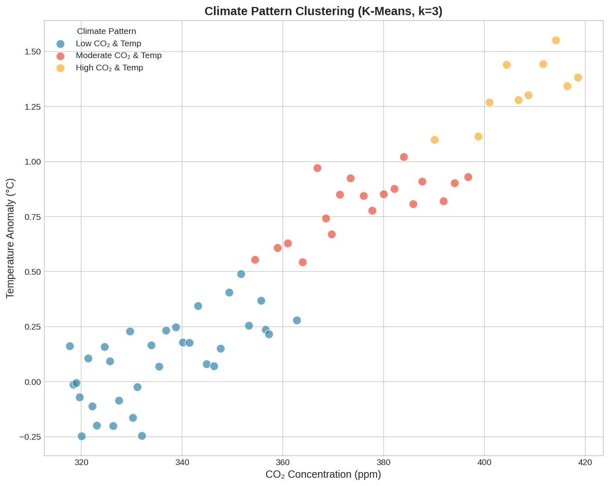

# 🌍 Carbon Emissions Impact Analysis

[](https://python.org)
[](https://pandas.pydata.org)
[](LICENSE)

A comprehensive data science project analyzing the relationship between global CO₂ concentrations and temperature anomalies from 1961 to 2022. This analysis provides statistical evidence of the strong correlation between rising carbon emissions and global warming.



---

## 📌 Project Overview

This project was developed to expand my data science portfolio while exploring one of the most critical environmental challenges of our time. Using historical data spanning over six decades, I applied statistical analysis, regression modeling, clustering techniques, and predictive scenario modeling to quantify the relationship between atmospheric CO₂ and global temperature changes.

**Key Finding:** A **95.5% correlation** exists between CO₂ concentrations and global temperature anomalies, with the model explaining over 91% of temperature variance.

---

## 🎯 Business Impact

Understanding the quantitative relationship between carbon emissions and temperature change is essential for:

- **Policy Making:** Providing data-driven evidence for climate policy decisions
- **Corporate Sustainability:** Helping organizations understand emissions impact for ESG reporting
- **Public Awareness:** Translating complex climate data into accessible insights
- **Predictive Planning:** Modeling "what-if" scenarios for emissions reduction strategies

---

## 📊 Key Findings

| Metric | Value |
|--------|-------|
| Pearson Correlation | **0.955** |
| R-squared | **0.912** |
| CO₂ Increase (1961-2022) | **100.88 ppm** (+31.8%) |
| Temperature Rise | **1.22°C** |
| Warming Rate | **0.02°C/year** |

### What-If Scenario Predictions

Based on the regression model, reducing global CO₂ by:
- **10%** → Could lower temperature anomaly to **0.79°C**
- **20%** → Could lower temperature anomaly to **0.12°C**

---

## 📁 Repository Structure

```
carbon_emissions/
├── README.md                    # This file
├── summary_report.md            # Non-technical executive summary
├── analysis.ipynb               # Main Jupyter notebook
├── carbon_analysis.py           # Standalone Python analysis script
├── data/
│   ├── carbon_emmission.csv     # Monthly CO₂ concentrations (1958-2024)
│   └── temperature.csv          # Country-level temperature anomalies (1961-2022)
├── figures/
│   ├── 01_time_series.png       # CO₂ and temperature over time
│   ├── 02_correlation_scatter.png
│   ├── 03_correlation_heatmap.png
│   ├── 04_decade_analysis.png
│   ├── 05_rate_of_change.png
│   ├── 06_clustering.png
│   ├── 07_scenario_analysis.png
│   └── 08_dashboard_summary.png
└── processed_data.csv           # Cleaned, merged analysis data
```

---

## 🚀 Quick Start

### Prerequisites

```bash
Python 3.10+
pip install pandas numpy matplotlib seaborn scipy scikit-learn
```

### Run the Analysis

```bash
# Clone the repository
git clone https://github.com/Rashad1019/carbon_emissions.git
cd carbon_emissions

# Run the analysis script
python carbon_analysis.py

# Or open the Jupyter notebook
jupyter notebook analysis.ipynb
```

---

## 🛠️ Tools & Technologies

- **Python 3.10+** - Core programming language
- **Pandas** - Data manipulation and analysis
- **NumPy** - Numerical computing
- **Matplotlib & Seaborn** - Data visualization
- **SciPy** - Statistical analysis (Pearson/Spearman correlation)
- **Scikit-learn** - Linear regression and K-Means clustering
- **Jupyter Notebook** - Interactive development environment

---

## 📈 Visualizations

### Time Series Analysis


### Correlation Analysis


### Decade Comparison


### Climate Pattern Clustering


---

## 📖 Documentation

| Audience | Document |
|----------|----------|
| **Non-Technical** | [Executive Summary (summary_report.md)](summary_report.md) |
| **Technical** | [Jupyter Notebook (analysis.ipynb)](analysis.ipynb) |
| **Quick Reference** | [This README](README.md) |

---

## 📊 Data Sources

1. **CO₂ Concentration Data**
   - Source: Global atmospheric CO₂ measurements
   - Coverage: Monthly data from 1958-2024
   - Unit: Parts per million (ppm)

2. **Temperature Anomaly Data**
   - Source: Country-level temperature deviations
   - Coverage: 225 countries/regions, 1961-2022
   - Unit: Degrees Celsius (°C) deviation from baseline

---

## 🔮 Future Enhancements

- [ ] Add regional analysis by continent
- [ ] Implement time series forecasting (ARIMA/Prophet)
- [ ] Build interactive Streamlit dashboard
- [ ] Include additional greenhouse gases (CH₄, N₂O)
- [ ] Add confidence intervals to predictions

---

## 👤 Author

**Rashad**

- 📧 Email: [Rashad19@outlook.com](mailto:Rashad19@outlook.com)
- 🐙 GitHub: [@Rashad1019](https://github.com/Rashad1019)
- 🌐 **Live Demo:** [https://rashad1019.github.io/carbon_emissions](https://rashad1019.github.io/carbon_emissions)

---

## 📄 License

This project is open source and available under the [MIT License](LICENSE).

---

## 🙏 Acknowledgments

- Temperature and CO₂ datasets from publicly available climate research
- Inspired by global climate analysis methodologies
- Built as part of an ongoing data science portfolio expansion

---

*If you find this project useful, please consider giving it a ⭐!*
