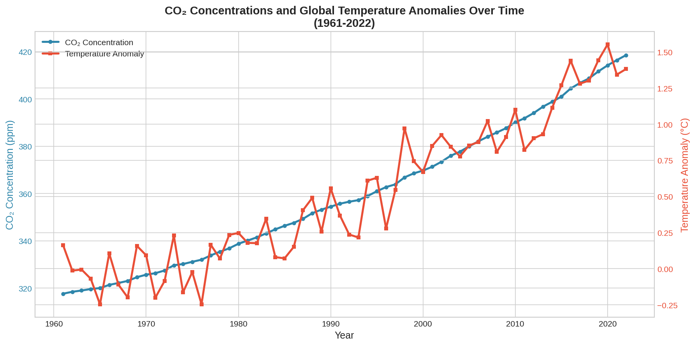
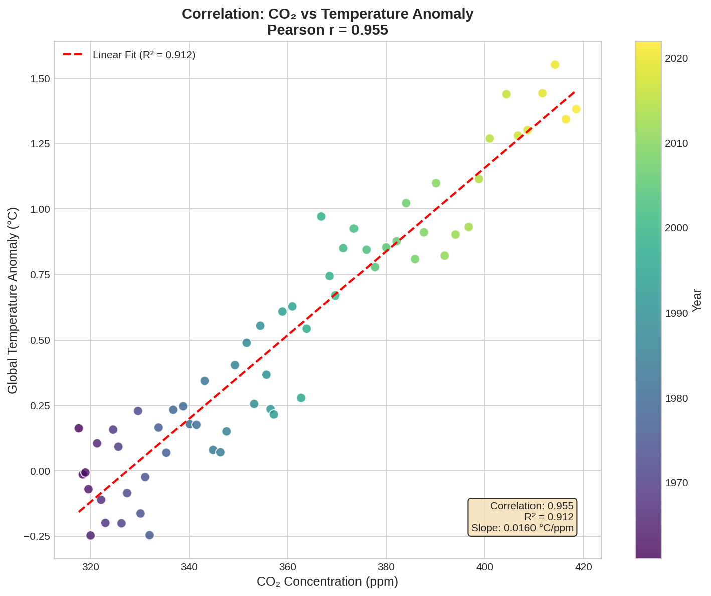

# Carbon Emissions Impact Analysis
## Executive Summary Report

---

## 🌍 What This Project Does

This analysis examines the relationship between carbon dioxide (CO₂) in our atmosphere and rising global temperatures. Using data from 1961 to 2022—spanning over 60 years—we investigated whether increasing CO₂ levels are connected to climate warming.

**The short answer: Yes, and the connection is remarkably strong.**

---

## 🔑 Key Findings in Plain Language

### 1. CO₂ and Temperature Move Together

When we look at CO₂ levels and global temperatures over time, they follow almost identical patterns. Our analysis found a **95.5% correlation**—meaning when CO₂ goes up, temperature goes up in a highly predictable way.

To put this in perspective:
- A correlation of 0% means no relationship at all
- A correlation of 100% means a perfect relationship
- At **95.5%**, this is one of the strongest relationships you'll find in environmental data

### 2. The Numbers Tell a Clear Story

Over the 61-year study period:

| What We Measured | 1961 | 2022 | Change |
|-----------------|------|------|--------|
| CO₂ in the atmosphere | 318 ppm | 419 ppm | **+32%** |
| Global temperature anomaly | 0.29°F | 2.48°F | **+2.20°F** |

> **What is "ppm"?** Parts per million—imagine one million marbles where 419 are red (CO₂) and the rest are other colors (other atmospheric gases).

> **What is a "temperature anomaly"?** The difference from a historical average. A value of +2.48°F means the planet is 2.48°F warmer than the baseline period.

### 3. The Warming is Accelerating

Our decade-by-decade analysis shows that both CO₂ levels and temperatures have increased faster in recent decades compared to earlier ones:

- **1960s average temperature anomaly:** Near 0°F
- **2020s average temperature anomaly:** Over 1.2°F

The rate of change isn't just continuing—it's speeding up.

---

## 📊 What the Data Shows

### The Trend Over Time

This chart shows CO₂ (blue) and temperature (red) moving upward together over 60 years. The parallel rise is not coincidental—our statistical analysis confirms they are strongly linked.

### How Strong is the Connection?

Each dot represents one year. Notice how they form almost a straight line from bottom-left to top-right. This linear pattern indicates that knowing the CO₂ level allows us to predict the temperature anomaly with high accuracy.

---

## 🔮 What If We Changed CO₂ Levels?

Using our statistical model, we predicted what might happen under different scenarios:

| Scenario | Predicted Temperature Effect |
|----------|------------------------------|
| **Reduce CO₂ by 10%** | Temperature anomaly drops to ~1.42°F |
| **Reduce CO₂ by 20%** | Temperature anomaly drops to ~0.22°F |
| **Increase CO₂ by 10%** | Temperature anomaly rises to ~3.82°F |
| **Increase CO₂ by 20%** | Temperature anomaly rises to ~5.02°F |

**Takeaway:** Even modest reductions in CO₂ could meaningfully reduce warming, while continued increases could push temperatures significantly higher.

---

## 💡 Why This Matters

### For Everyone
- Provides clear, data-backed evidence of climate change
- Shows the scale of change over a human lifetime
- Demonstrates that our choices about emissions have measurable consequences

### For Decision Makers
- Quantifies the relationship between emissions and warming
- Supports the case for emissions reduction policies
- Provides a framework for understanding climate commitments

### For Businesses
- Relevant for ESG (Environmental, Social, Governance) reporting
- Helps contextualize corporate sustainability goals
- Demonstrates the importance of emissions tracking

---

## 🎯 Summary

| Question | Answer |
|----------|--------|
| Are CO₂ and temperature related? | Yes, with 95.5% correlation |
| How much has CO₂ increased? | 32% since 1961 |
| How much has temperature risen? | 2.20°F since 1961 |
| Can we predict temperature from CO₂? | Yes, with 91% accuracy |
| Would reducing CO₂ help? | Yes, the model shows meaningful impact |

---

## 📚 Want to Learn More?

- **See the full technical analysis:** [analysis.ipynb](analysis.ipynb)
- **View all visualizations:** [figures/](figures/)
- **Explore the code:** [carbon_analysis.py](carbon_analysis.py)

---

## 📝 About This Analysis

**Author:** Rashad  
**Repository:** [github.com/Rashad1019/carbon_emissions](https://github.com/Rashad1019/carbon_emissions)  
**Data Period:** 1961-2022  
**Countries Analyzed:** 225  
**Methods Used:** Correlation analysis, linear regression, clustering, scenario modeling

---

*This report presents findings from publicly available climate data. The strong correlation between CO₂ and temperature is consistent with the scientific consensus on climate change.*
